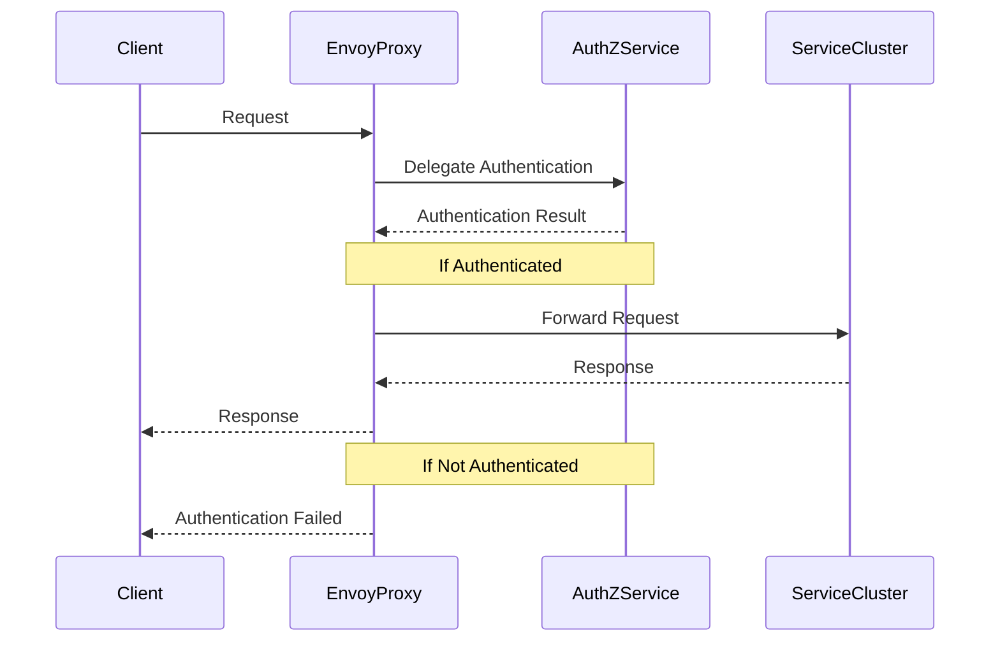

## architecture

```mermaid
sequenceDiagram
    participant Client
    participant EnvoyProxy
    participant AuthZService
    participant ServiceCluster
    Client->>EnvoyProxy: Request
    EnvoyProxy->>AuthZService: Delegate Authentication
    AuthZService-->>EnvoyProxy: Authentication Result
    Note over EnvoyProxy,AuthZService: If Authenticated
    EnvoyProxy->>ServiceCluster: Forward Request
    ServiceCluster-->>EnvoyProxy: Response
    EnvoyProxy-->>Client: Response
    Note over EnvoyProxy,AuthZService: If Not Authenticated
    EnvoyProxy-->>Client: Authentication Failed
```